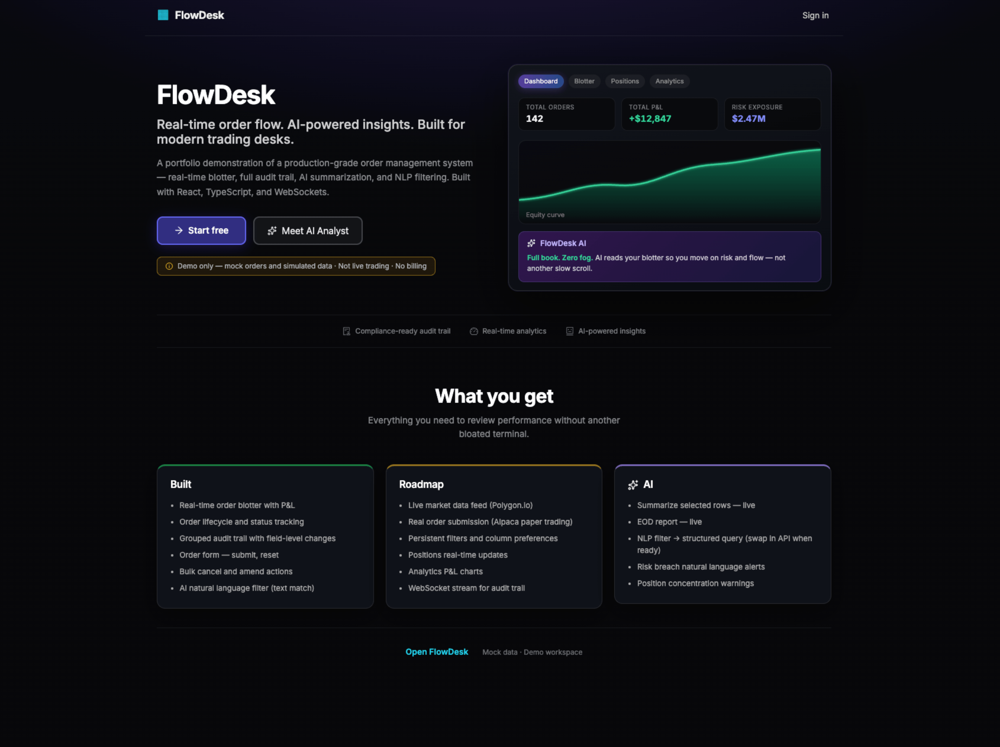
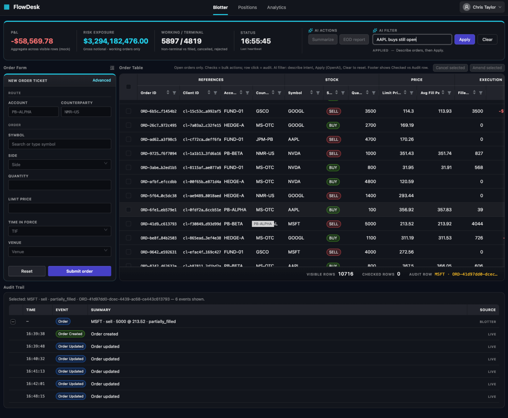

# FlowDesk

**FlowDesk** is aimed at becoming a **modern order-management and trading workspace**: one place to watch **live order flow**, manage lifecycle (submit, amend, cancel), see **P&L and exposure**, drill into a **field-level audit trail**, and layer **AI and natural language** on top—always anchored to structured, verifiable facts from the book, not hand-wavy guesses.





**Where this repo is headed**

- **Real connectivity** — authenticated APIs and WebSockets for orders, fills, and reference data; server-side validation, idempotent submits, and durable history.  
- **Desk-grade UX** — fast virtualized blotters, saved layouts, alerts, and workflows that match how PMs and traders actually work.  
- **Compliance and ops** — immutable-style audit narratives, exportable trails, and clear separation between **deterministic metrics** and **optional LLM prose**.  
- **AI as an assistant** — row summaries, EOD narratives, and NLP filters that consume **typed facts** from the store (summaries, selections, aggregates) so outputs stay checkable against the grid.

**What ships today**

A **demo workspace** with a marketing **landing page**, a **dark Ant Design** shell, a **typed blotter domain** in **Zustand**, mock **real-time-style** stream events, virtualized **tables**, **order entry**, **stats / NLP filter UI**, and an **order → event audit tree** wired to the same ingestion path—built with **Vite**, **React**, and **TypeScript**.

## Stack

**Client**

- React 18 + TypeScript + Vite  
- Ant Design 5 (layout, form, tables, dark `ConfigProvider`)  
- Zustand for blotter state and stream ingestion  
- React Router  

**Server**

- Node.js + TypeScript (run with **tsx**)  
- Express 5 (HTTP API: `GET /orders`, health, etc.)  
- **ws** (WebSocket blotter stream)  
- PostgreSQL (**`pg`**) for orders + audit event persistence  

## Run it

### Client (Vite + React)

```bash
npm install
npm run dev
```

Open `/` for the landing experience and `/app` for the FlowDesk workspace.

Other client/root scripts:
- `npm run build`
- `npm run lint`
- `npm run preview`

The React app lives under **`client/`** (`client/src`, `client/index.html`, `client/public`). Builds emit to **`dist/`** at the repository root.

### Server (Express + ws)

Express + **`ws`** in **`server/`**: **`GET /health`**, WebSocket **`/blotter-stream`**, and one JSON text frame per message using the same discriminated event shape the client ingests (`order_created`, `order_updated`, `order_cancelled`, `order_rejected`, `heartbeat`).

Current behavior in `server/src/index.ts`:

- Per-connection state (`sequence`, order counter, in-memory live order map)
- Immediate `order_created` on connect
- Continuous interval-based mock lifecycle events (create/update/reject/cancel)
- Independent heartbeat tick every 4s
- Interval cleanup on socket close

`GET /blotter-stream` returns a JSON hint (streams are **WebSocket**, not a normal HTTP page).

Dev proxy: with client `npm run dev`, Vite proxies **`/blotter-stream`** and **`/orders`** to **`127.0.0.1:8000`** (same as the server’s default **`PORT`**). If you run the API on another port, set **`PORT`** when starting the server **and** point `vite.config.ts` `server.proxy` at that port.

```bash
cd server && npm install
# start server (listens on 8000 by default)
npm run dev
# other terminal — health check:
curl http://localhost:8000/health
# optional: npx wscat -c ws://localhost:8000/blotter-stream
```

From the repo root you can run **`npm run dev:server`** (same as running `npm run dev` inside `server/`). Override port with **`PORT`** if needed, and keep Vite’s proxy target in sync.

To drive the workspace from the stream server instead of the in-browser mock, set **`VITE_BLOTTER_WS_URL`** (see [`.env.example`](.env.example)), e.g. `ws://127.0.0.1:8000/blotter-stream`, or use the Vite dev proxy with **`ws://127.0.0.1:5173/blotter-stream`** while **`npm run dev`** and **`npm run dev:server`** are both running.

## Features covered

- [x] **Typed blotter domain** — `Order`, branded ids, and discriminated `BlotterStreamEvent` shapes shared by mock stream and UI  
- [x] **Single ingestion path** — Zustand store merges all stream-style events via `ingestEvent` (no ad-hoc row patches in components)  
- [x] **Dual entry of orders** — configurable mock emitter plus delayed `submitOrder` API; both emit `order_created` / updates into the store  
- [x] **Blotter table UX** — sort & column filters, virtual scroll, grouped headers, fixed selection + key reference columns, P&L column  
- [x] **Order ticket & layout** — Ant `Form` + validation, collapsible order column (preference persisted in `localStorage`), stats strip  
- [x] **Order submit form** — `OrderEntryForm` ticket (`client/src/features/order-entry/`) with validation and submit into the blotter / stream ingestion path  
- [x] **`GET /orders/:id/audit`** — HTTP API returning persisted `order_audit_events` for an order (for bottom audit tree / detail)  
- [ ] **Configure AI filter** — NLP-style filter on the stats strip (`filterOrdersByTextQuery` + query state); wire to real NLP / gateway config when ready  
- [ ] **Audit trail (mocked for now)** — tree-table style audit surface for hierarchy previews (mock tree-table UI) plus stream-derived audit domain in store/mappers  

## Main todos

- [x] Enrich mock stream by reusing the same data types and event shapes as the websocket/backend feed.
- [x] Configure backend data layer (Postgres, connection management, migrations baseline).
- [x] Add Postgres tables for audit and audit events (initial schema).
- [x] Create `auditRepo`, `ordersRepo` and `streamProjector` to ingest event envelopes and dedupe safely into DB 
- [x] **Fetch → delta init** — `GET /orders` hydrates the blotter store (`hydrateOrdersFromApi`), then the WebSocket opens for stream deltas (`useBlotterLiveBootstrap` gates `useBlotterWebSocketStream`); dev uses same-origin `/orders` via Vite proxy (optional `VITE_BLOTTER_HTTP_URL`).
- [x] Configure API layer endpoint: `GET /orders` (list).  
- [x] Expose `GET /orders/:id/audit` — `listAuditEventsByOrderId` in `server/src/db/repos/auditRepo.ts`, route on `ordersRouter`.  
- [ ] Consume `GET /orders/:id/audit` in the audit tree UI.
- [ ] Implement audit trail tree view from API data (shape, transform to tree, render).
- [ ] Configure master/detail view for order list and selected order context.

## Roadmap

Cross-cutting work (**production hardening**, **AI / NLP on top of deterministic facts**) is tracked in [`docs/roadmap.md`](docs/roadmap.md) so this README stays shorter.

## Where things live

| Area | Path |
|------|------|
| Routes & landing | `client/src/App.tsx`, `client/src/features/landing/` |
| Workspace (blotter shell, stats, order form) | `client/src/PrimeBlotterApp.tsx`, `client/src/App.css` |
| Blotter store & stream types | `client/src/features/blotter/store/useBlotterStore.ts`, `client/src/features/blotter/types.ts` |
| Live: `GET /orders` → hydrate, then WS | `client/src/features/blotter/realtime/useBlotterLiveBootstrap.ts`, `useBlotterWebSocketStream.ts`, `blotterWebSocketAdapter.ts` · [flow](docs/blotter-fetch-then-websocket.md) |
| Order grid | `client/src/features/table/BlotterTable.tsx` |
| API, WebSocket stream, Postgres | `server/src/index.ts`, `server/src/realtime/blotterStream.ts`, `server/src/db/` |
